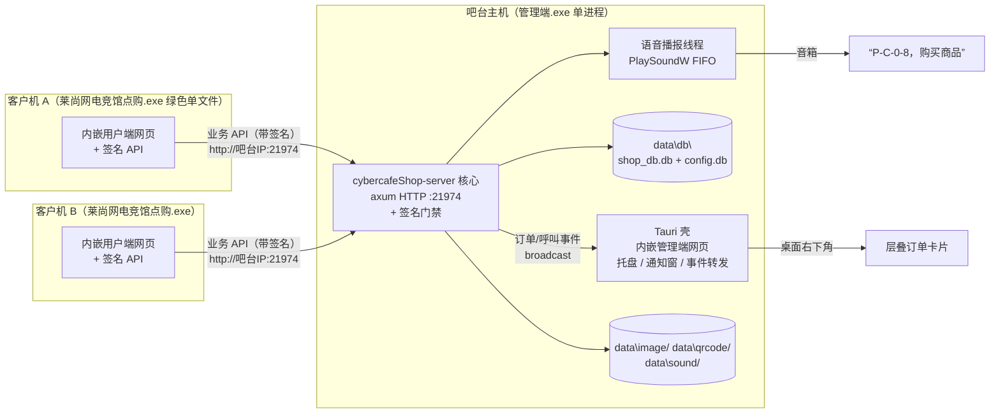
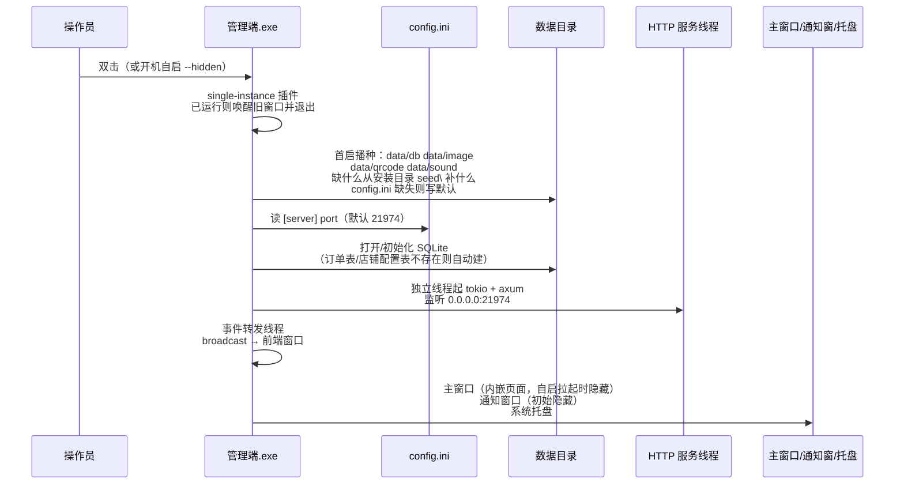
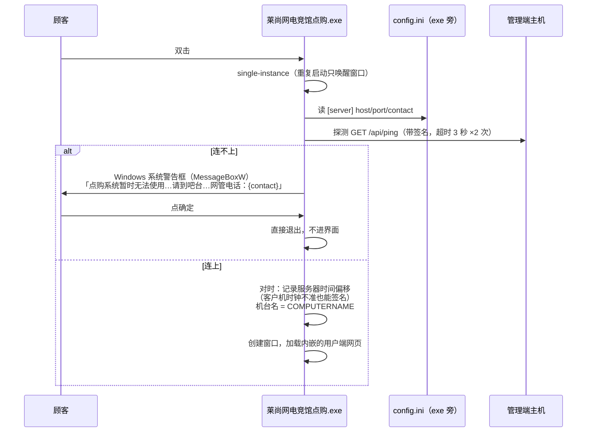
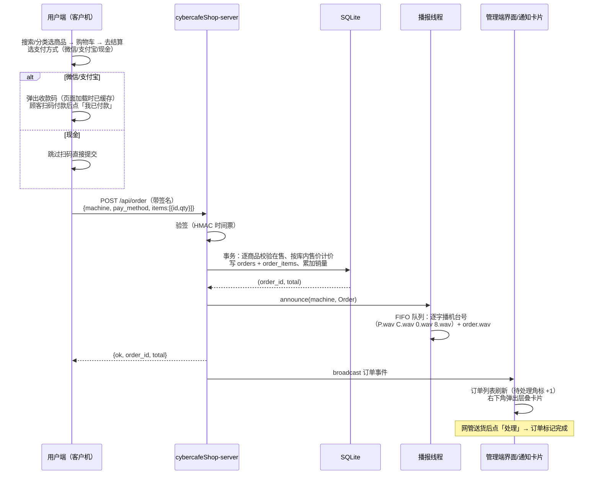
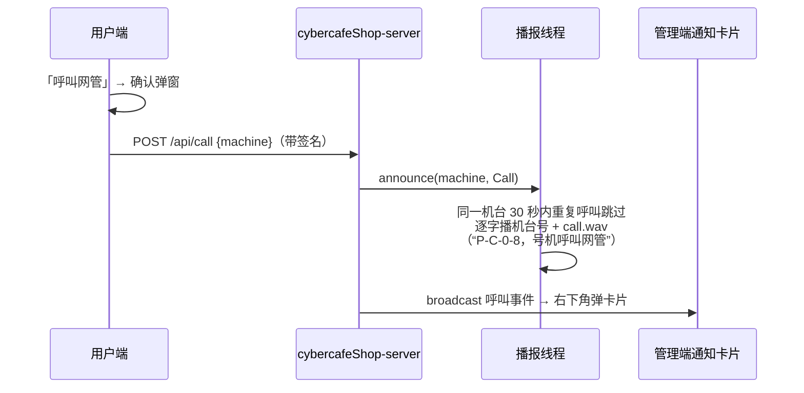
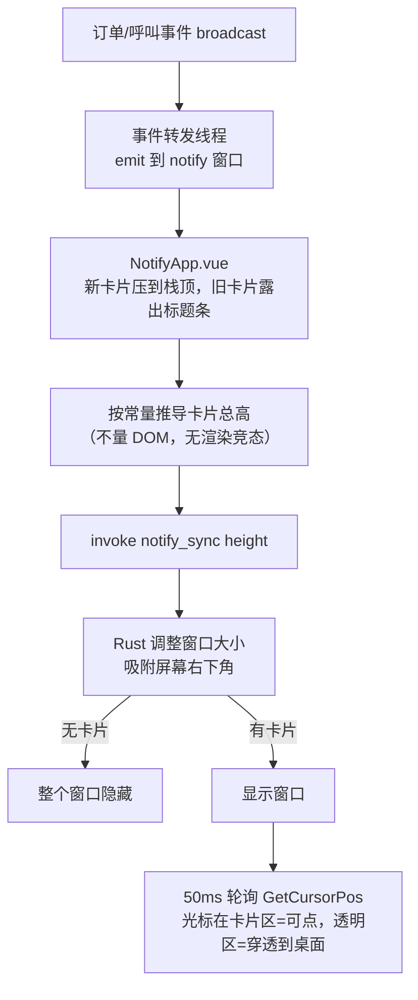
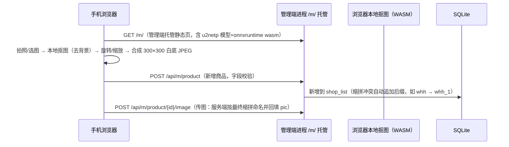
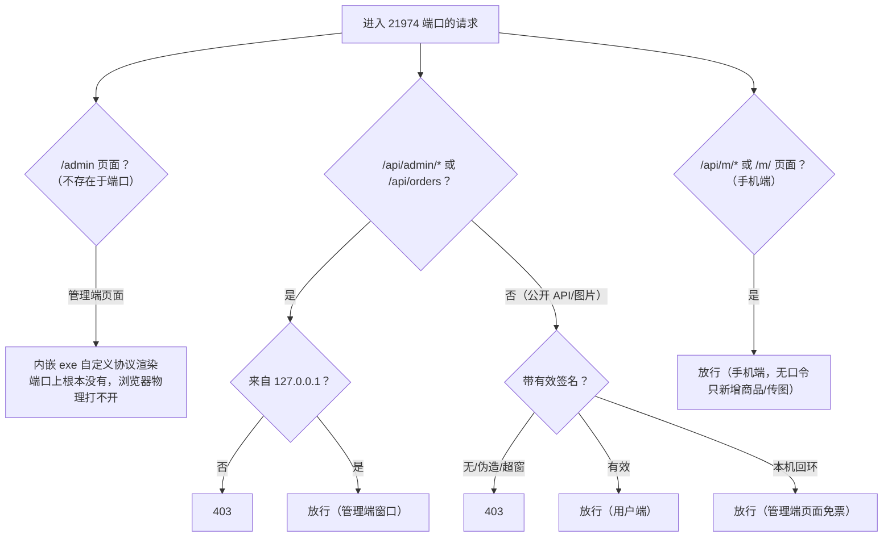

# 网吧点购系统（cybercafeShop）

本软件是一款集商品销售、管理、客户端点购、呼叫网管等为一体的综合商品管理软件，极大提高了上网顾客购买商品的方便性。适用于网吧局域网内，顾客自助点单、吧台统一管理与语音播报、网管响应呼叫的场景。

- **管理端**（吧台主机 ×1）：安装版（NSIS 安装包），内嵌 HTTP 服务 + 语音播报 + 桌面订单卡片 + 商品/订单/销售/设置管理
- **用户端**（每台客户机）：绿色软件，`莱尚网电竞馆点购.exe` 双击即用，无需安装
- **手机端**（吧台人员手机）：浏览器打开 `/m/` 即可用手机添加商品，含本地抠图（去背景）、旋转、白底裁切，下单管理仍在吧台主机完成

---

## 1. 技术栈

| 层 | 技术 | 说明 |
|---|---|---|
| 桌面壳 | Tauri 2（Rust） | 单实例、托盘、无边框通知卡片（CSS 圆角、不透明）、开机自启 |
| 前端 | Vue 3 + Vite 5 + Element Plus | Element Plus 按需加载（unplugin-auto-import / unplugin-vue-components） |
| 服务端 | axum 0.8 + tokio（独立 Rust lib crate `cybercafeShop`） | 内嵌在管理端进程里，监听局域网，提供业务 API |
| 手机端 | Vue 3 + Vite 5 + Element Plus + U²-Netp 抠图（onnxruntime-web WASM） | 独立 `mobile/` workspace，页面由管理端 HTTP 托管在 `/m/` |
| 数据库 | SQLite（rusqlite 0.32 bundled） | 商品/分类/订单/店铺配置 |
| 语音 | winmm `PlaySoundW`（SND_SYNC） | wav 音频，FIFO 队列逐条播完 |
| 目标平台 | Windows 10+（需系统 WebView2 Runtime，Win11 必带，Win10 装过 Edge/Office 即自带） | 内存占用约 40MB |

**网页分布（两端各自内嵌）：**

- **管理端网页内嵌 exe**（Tauri 自定义协议渲染，不走 TCP 端口）——管理界面在局域网里物理不可见
- **用户端网页也内嵌在用户端 exe**（`莱尚网电竞馆点购.exe` 绿色单文件自带界面），通过带签名的 API 连管理端拉数据。换界面需要重新编译用户端 exe
- **手机端**：独立 `mobile/` 工程，`build:mobile` 产出静态页后由管理端 HTTP 服务托管在 `/m/`（局域网内 `http://吧台IP:21974/m/` 访问）。因不含任何业务 API 的敏感操作（只新增商品/传图），且页面地址不对外宣传，未做登录口令（见 §5.3）

---

## 2. 总体架构与数据流



关键约束：

- **只有吧台主机有数据库和音频文件**，用户端 exe 是"自带网页的绿色单文件 + 配置"，不存任何业务数据。
- **手机端**经 `http://吧台IP:21974/m/` 访问，只做添加商品/传图（`/api/m/*`），不开放删除/订单/销售/店铺配置，收窄攻击面。
- 金额一律以服务端数据库售价为准，**客户端报的任何价格字段都被忽略**（防篡改）。
- 管理端管理类 API（`/api/admin/*` + 订单接口）有回环守卫，**只有 127.0.0.1 能调**，客户机调了也是 403。
- 业务 API 有 **HMAC 签名门禁**，局域网浏览器裸开 IP：端口 = 403（详见 §5.3）。

---

## 3. 生产启动流程

### 3.1 管理端启动（生产）



窗口行为：**点 X = 收起到托盘**（HTTP 服务不能停）；托盘左键 = 重新打开；托盘右键菜单 → 退出，才是真正退出（HTTP 服务随进程结束）。开机自启由设置页开关控制（`--hidden` 参数拉起时不弹主窗口）。

### 3.2 用户端启动（生产）



窗口行为：点 X = **直接退出**，不进托盘不占资源。页面运行中连不上管理端时显示「连不上吧台主机」+ 重试按钮。

---

## 4. 核心业务流程（吧台日常操作所依赖的行为）

### 4.1 下单（扫码/现金）



### 4.2 呼叫网管



### 4.3 语音播报规则

| 事件 | 播放序列 | 说明 |
|---|---|---|
| 下单 | 机台号逐字（0-9/A-Z）→ `order.wav` | 机台号全是中文/符号时改播 `message.wav` |
| 呼叫网管 | 机台号逐字 → `call.wav` | 同一机台 30 秒内只播一次（防刷屏） |

- 单工作线程 + FIFO 队列：前一条完整播完才播下一条（同步播放）。
- **原则：所有播报都必须播，绝不丢**——播报队列是无界的（`std::sync::mpsc::channel`，`send` 不阻塞不丢）。即使下单/呼叫瞬间密集、播报线程一时跟不上，也只是在内存里排队等播，**不会**为省内存而丢弃任何一条播报（丢播报是明确不允许的，改这一条前先确认是否违背此约定）。代价是极端高峰时队列会短暂堆积，但吧台机 24h 运行下这种高峰远低于播报能力，属可接受。
- 呼叫去重表只保留 **30 秒窗口内**叫过的机台（`retain` 每 30s 淘汰），不会随 24h 运行无限累积。
- 机台名里播不出来的字符（中文、符号）自动跳过；磁盘上缺哪个 wav 就跳过哪个。
- 机台名取 **COMPUTERNAME（设备名称）**，不是用户名。

### 4.4 桌面通知卡片（层叠式）



- **层叠覆盖，不摊开**：一张卡片压在另一张上面，旧卡片从窗口顶部依次只露 32px 标题条，点标题条提到最前；同一机台重复呼叫不叠卡（刷新时间并置顶）。卡片再多也不会跑出屏幕。
- 窗口大小 = 卡片实际总高，窗口吸附右下角、距屏幕底边 60px 避开任务栏；无卡片时整个窗口隐藏，不占桌面。
- 圆角用 CSS 实现（窗口本身不透明，圆角外同色深底，不再用 SetWindowRgn 裁剪）；窗口外区域鼠标可穿透（点得到后面的桌面/游戏）。
- 通知窗口：无边框、置顶、不抢焦点、不进任务栏。

### 4.5 店铺信息 / 商品 / 收款码管理（管理端）

- 店铺信息：设置页可改**店名**和**客户端欢迎语**（两个独立项），存数据库；用户端每次打开页面时经 `/api/shopinfo` 拉取，显示在顶部。
- 商品：新增/编辑（名称、分类、缩拼、进价、售价、图片）/上架/下架/删除；**缩拼由前端按名称自动生成拼音首字母**（多音字取常用读音），可手改；**缩拼冲突时**新增商品自动追加 `_1`/`_2`……直到唯一（`whh` → `whh_1`）；图片与手机端同一套本地抠图流程（选图 → 抠图 → 旋转/缩放 → 合成 300×300 白底 JPEG）；模型与 wasm 不打进 exe，统一从手机端托管的 `/m/bgrem/` 加载并用 IndexedDB 缓存，全系统只存一份。管理端抠图在一次性 Web Worker 里跑、用完 `terminate` 释放内存（onnxruntime 的 WASM 堆只增不减、`dispose()` 收不回，唯有销毁 worker 才能把 ~200MB 还给系统）；抠图编辑器与 onnxruntime 也做懒加载（不进主 bundle），降低吧台机 24h 常驻内存。图片文件名：两端都由服务端按「该商品的最终缩拼」命名并回填——**先建商品拿到 id、再按 id 传图**（`product_abbr(id)` 取唯一化后的缩拼命名），同缩拼商品（`whh`/`whh_1`）图片名不冲突，删除商品也不会误删别家商品的共用图。
- **图片编辑器（两端同一套交互，差异点见下）**：
  - **共同点**：选图 → 画布**立即空白 300×300** → 后台抠图去背景，画布叠加**两个独立进度条**——「下载模型」（仅**首次无缓存**时出现，真实下载进度 0→100%；有缓存则直接读 IndexedDB、不显示下载条）和「处理图片」（每次都有，平滑进度 0→100%）→ 抠图完成填充透明图 → **旋转**（滑杆 ±45° 或图上左右拖动）/ **缩放** / **水平翻转** / **重置** → 「应用」导出 300×300 白底 JPEG；处理中「应用」不可用（点它会提示「商品图还没处理好」，避免导出空白图）；模型统一从 `/m/bgrem/` 加载 + IndexedDB 缓存。
  - **差异**：
    | 项 | 手机端 | 管理端 |
    |---|---|---|
    | 进图入口 | 📷拍照 / 🖼从相册 | 系统文件框 |
    | 抠图/读取失败 | 回选图页重新选择 | 提示「可重新选图」，画布留空白 |
    | 重选入口 | 重新拍照 / 重新选择（按来源） | 重新选图 |
    | 触摸事件 | 有（手机上拖动旋转） | 无（鼠标拖动） |
    | 抠图底层 | 每次 cutout 新建 session、finally dispose | 一次性 Web Worker，用完 terminate（释放 onnxruntime WASM 堆，避免 ~200MB 常驻） |
- 分类：新增/改名（同步商品表）/删除（分类下有商品时拒绝）。
- 收款码：设置页上传微信/支付宝收款码，用户端**下次打开页面时**生效。

### 4.6 商品搜索与卡片布局（用户端）

- 搜索框紧跟分类页签后方，提示「输入商品名或者首字母如娃哈哈（whh）」。
- 输入**字母/数字** → 按商品缩拼匹配（`whh` → 娃哈哈）；输入**中文** → 按商品名包含匹配（`哈哈` → 娃哈哈）。自动判断，不用切换。
- 纯前端本地过滤，不产生请求；搜索时忽略分类页签（搜全部商品）。
- 商品卡片：固定 5 列、每列最宽 300px；300×300 图片全幅在上，深色信息条在下（名称 + 价格 + 已售）；**整卡点击即加入购物车**。
- **下单流程**：加购 → 右侧改数量 → 「去结算」选支付方式（微信/支付宝扫码付款 / 现金直接提交）→ 提交。**提交防连点**（`submitting` 守卫，双击/网络卡不会下出重复订单）；**失败时刷新商品列表**，把购物车里已下架/已删条目清掉、在售的同步最新价，再显示服务端返回的具体原因（如「「xxx」刚被吧台下架了」），顾客不会被「提交失败」卡死。

### 4.7 手机端添加商品（吧台人员）

吧台人员用手机浏览器打开 `http://<吧台机IP>:21974/m/`，即可添加商品，无需在吧台主机操作。



- **页面**：独立 `mobile/` Vue 工程，构建产物由管理端 HTTP 服务托管在 `/m/`。手机页不含删除/改名/订单/销售/店铺配置，只做新增商品 + 传图，收窄攻击面。
- **抠图**：浏览器本地 U²-Netp 模型（`isnet_quint8` 之外的最小档，`u2netp.onnx` ~4.6MB）+ onnxruntime wasm，由吧台机离线托管在 `/m/bgrem/`，**不依赖外网**；处理中画布上显示假进度条（首次加载模型会多走一会，有缓存一闪而过）；抠图失败回到选图页重新选择。
- **缩拼冲突唯一化**：同名商品缩拼重复时，后端自动追加 `_1`/`_2`……直到唯一（`whh` → `whh_1`），避免图片文件名互相覆盖。

---

## 5. HTTP API 参考

### 5.1 公开 API（客户机可访问，需签名）

| 方法 | 路径 | 说明 |
|---|---|---|
| GET | `/api/ping` | 存活探测 + 返回服务器时间（对时用）；不加密 |
| GET | `/api/shopinfo` | 店铺信息 `{shop_name, welcome}` |
| GET | `/api/products` | 在售商品 + 分类（含缩拼、销量） |
| POST | `/api/order` | 下单 `{machine, pay_method, items}`；价格以服务端为准 |
| POST | `/api/call` | 呼叫网管 `{machine}` |
| GET | `/image/{name}` | 商品图片（文件名白名单校验，防路径穿越） |
| GET | `/qrcode/{wechat\|alipay}` | 收款码图片 |

### 5.2 管理端 API（仅 127.0.0.1）

| 方法 | 路径 | 说明 |
|---|---|---|
| GET/POST | `/api/admin/shopinfo` | 读/改店铺信息（店名、欢迎语） |
| GET | `/api/admin/hostinfo` | 本机局域网 IPv4（添加商品弹窗的手机端二维码用） |
| GET | `/api/orders` · POST `/api/order/{id}/status` | 订单列表/标记处理（订单页最多显示最近 500 条） |
| GET | `/api/admin/products` | 全部商品（含进价/上下架状态） |
| POST | `/api/admin/product` | 新增/修改商品（缩拼由前端按名称自动生成后上传） |
| POST | `/api/admin/product/{id}/state` | 上架/下架 |
| DELETE | `/api/admin/product/{id}` | 删除商品 |
| GET/POST/DELETE | `/api/admin/categories` `/category` `/category/{name}` | 分类管理 |
| POST | `/api/admin/image/{name}` | 上传商品图片（≤2MB，JPG/PNG 魔数校验） |
| POST | `/api/admin/qrcode/{kind}` | 上传收款码 |
| GET | `/api/admin/records?from&to&pay` | 销售记录 + 合计 |

请求体上限：公开 API 64KB，管理端 2MB（图片校验上限；DefaultBodyLimit 3MB），手机端 3MB（图片上传）。

### 5.2.1 手机端 API（/api/m/*，无口令）

| 方法 | 路径 | 说明 |
|---|---|---|
| GET | `/api/m/categories` | 分类列表（复用 `db.categories()`） |
| POST | `/api/m/product` | 新增商品（复用 `ProductIn` 字段校验，缩拼冲突自动加后缀 `_1`） |
| POST | `/api/m/product/{id}/image` | 给已建商品传图（≤3MB，JPG/PNG 魔数校验；文件名按商品最终缩拼生成并回填 pic） |

静态托管：`GET /m/` → `web/m/` 目录（`tower-http::ServeDir`），即手机添加商品页。手机端**不暴露**删除/改名/订单/销售/店铺配置。

### 5.3 安全设计（三层）



1. **管理端网页内嵌 exe**：Tauri 自定义协议渲染，TCP 端口上不存在这个页面，局域网无法通过浏览器访问管理界面。
2. **管理 API 仅本机**：`/api/admin/*` 与订单接口只接受 127.0.0.1。
3. **公开资源 HMAC-SHA256 签名门禁**：签名 = `HMAC(密钥, 时间戳)`，±300 秒有效；密钥只编译在两端 exe 里，不进任何静态文件。API 走 header、`` 走 query；系统通过 `/api/ping` 对时，客户机时钟错乱也能正常签名。
4. **手机端 `/*/m*` 无口令**：页面地址不对外宣传，网吧顾客一般接触不到（局域网自用，风险可接受）。只暴露新增商品/传图，不开放删除/订单/销售/店铺配置。若需更强防护，可给 `/api/m/*` 加口令换 token（服务端 `mobile.rs` 早期版本有完整实现）。

> 这套防的是网吧顾客拿浏览器/抓包工具乱点；真正值钱的东西（计价、订单、管理操作）全部由服务端校验和本机守卫兜底，前端不承载任何信任。

---

## 6. 数据库结构（data/db/shop_db.db + data/db/config.db）

两个库分开存：**商品/订单**在 `shop_db.db`，**店铺配置**在 `config.db`（同目录）——店铺信息（店名、欢迎语）是独立库，清理或重建商品数据时不受影响。

### 6.1 商品/订单库 `data/db/shop_db.db`

完整建表语句（`orders` / `order_items` 首启自动创建，`shop_fl` / `shop_list` 由种子库携带）：

```sql
-- 分类
CREATE TABLE shop_fl (
  id INTEGER PRIMARY KEY AUTOINCREMENT,
  class_name TEXT,    -- 分类名（「全部商品」为系统分类，class_px=100，不可删/改名）
  class_px INTEGER,   -- 排序值，大的排前面；新分类自动取 当前最小值-1（排到最后）
  class_ext_1 TEXT    -- 预留
);

-- 商品
CREATE TABLE shop_list (
  id INTEGER PRIMARY KEY AUTOINCREMENT,
  gds_number TEXT,    -- 缩拼（拼音首字母，如 whh；前端按名称自动生成后上传，后端原样存储；冲突时后端加后缀 _1/_2…）
  gds_class TEXT,     -- 分类名（关联 shop_fl.class_name）
  gds_name TEXT,      -- 商品名
  gds_jhj INTEGER,    -- 进价
  gds_xsj INTEGER,    -- 售价（下单计价以此为准）
  gds_gys TEXT,       -- 供应商，预留
  gds_pic TEXT,       -- 图片文件名（data\image\ 目录下，如 bskl.jpg）
  gds_px INTEGER,     -- 排序值，大的排前面
  gds_state INTEGER,  -- 1 上架 / 0 下架（停止销售）
  gds_out INTEGER,    -- 累计销量（下单自动累加）
  gds_js TEXT,        -- 预留
  gds_ext_1 TEXT, gds_ext_2 TEXT, gds_ext_3 TEXT  -- 预留
);

-- 订单（一单一行）
CREATE TABLE orders (
  id INTEGER PRIMARY KEY AUTOINCREMENT,
  machine TEXT NOT NULL,     -- 机台名（COMPUTERNAME）
  pay_method TEXT NOT NULL,  -- wechat / alipay / cash
  total REAL NOT NULL,       -- 合计（服务端按库内售价计算）
  status INTEGER NOT NULL DEFAULT 0,  -- 0 待处理 / 1 已处理
  created_at TEXT NOT NULL DEFAULT (datetime('now','localtime'))
);
CREATE INDEX idx_orders_time ON orders(created_at);

-- 订单明细（下单时的价格快照）
CREATE TABLE order_items (
  id INTEGER PRIMARY KEY AUTOINCREMENT,
  order_id INTEGER NOT NULL, -- 关联 orders.id
  gds_name TEXT NOT NULL,
  price REAL NOT NULL,
  qty INTEGER NOT NULL
);
CREATE INDEX idx_items_order ON order_items(order_id);
```

### 6.2 店铺配置库 `data/db/config.db`

首启自动创建并写入默认值，与商品库完全独立：

```sql
-- 店铺配置（键值对）
CREATE TABLE shop_config (
  key TEXT PRIMARY KEY,      -- shop_name 店名 / welcome 欢迎语
  value TEXT NOT NULL
);
-- 首启自动写入默认店名与欢迎语（可在管理端设置页修改，默认欢迎语为「欢迎光临，祝您游戏愉快」）
```

---

## 7. 生产目录与配置约定

```
管理端（安装版，NSIS 安装包，当前用户安装，无需管理员权限）
{安装目录}\
├─ 管理端.exe             （管理端网页内嵌其中）
├─ seed\                  首启种子（安装包携带：空库 + 音频 + 收款码占位 + 手机页，★ 不含商品）
│  ├─ data\               空库 + 音频 + 收款码占位（data 目录缺什么补什么）
│  └─ web\m\              手机端添加商品页面（构建自 mobile/，★ 含 u2netp 模型 + onnxruntime wasm）
├─ config.ini             [server] port = 21974（仅此一项，界面上不可改）
├─ data\                  业务数据目录（首启播种：缺什么从 seed\data 补什么）
│  ├─ db\
│  │  ├─ shop_db.db       商品库 + 订单（首启播种为空库，商品在管理端录入）
│  │  └─ config.db        店铺配置（店名/欢迎语，首启自动创建；★ 独立库，与商品库互不影响）
│  ├─ image\              商品图片（首启播种为空，商品管理里上传）
│  ├─ qrcode\             收款码（首启播种，设置页可换）
│  └─ sound\              播报 wav（首启播种）
└─ web\m\                 手机页运行时目录（每次启动从 seed\web\m 整目录覆盖，升级后也更新）

用户端（绿色软件，不安装，放每台客户机）
dist\用户端\
├─ 莱尚网电竞馆点购.exe   双击即用（网页内嵌其中，绿色单文件）
└─ config.ini             [server] host = 吧台主机IP
                          [server] port = 21974
                          [server] contact = 网管联系电话（连不上时警告框显示）
```

- 用户端 `config.ini` 三项：`host`（吧台机局域网 IP）、`port`、`contact`（联系方式，连不上吧台时弹窗提示顾客用）。
- 管理端数据根目录默认 = exe 所在目录；可用环境变量 **`DATA_DIR`** 覆盖（测试隔离用）。

---

## 8. 部署

1. 吧台主机：运行 `dist\cybercafeShop-admin_v【版本号】_setup.exe` 安装（当前用户安装，不需要管理员权限），启动「莱尚网电竞馆点购管理端」一次让目录生成（防火墙弹窗选允许局域网），然后从托盘右键退出。
2. 改 `dist\用户端\config.ini` 的 `host` 为吧台主机局域网 IP、`contact` 为网管电话。
3. 每台客户机：拷贝 `dist\用户端\` 整个文件夹，运行 `莱尚网电竞馆点购.exe`。
4. 管理端设置页：填店名/欢迎语、上传真实收款码。
5. （可选）吧台人员用手机浏览器打开 `http://<吧台机局域网IP>:21974/m/` 即可用手机添加商品（含抠图）；页面地址可自行决定是否告知他人。
